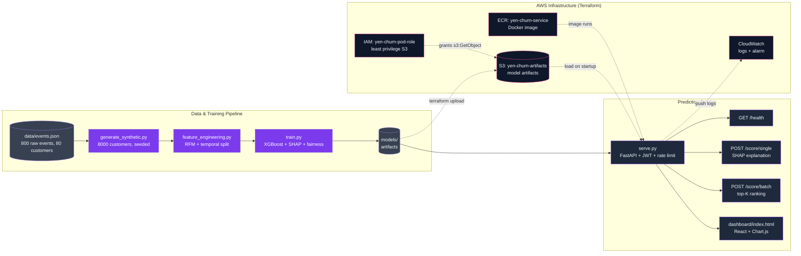

# Churn Prediction Service

> Forward Deployment Engineering Assignment — Localytics
> Yenifer Hernandez

## Overview

This is a working churn prediction service built end to end from a raw mobile marketing event stream. It takes 800 raw events across 80 customers — sessions, purchases, pushes, clicks, support tickets — and turns them into a per-customer RFM feature table, a trained and audited model, and a live scoring API with a dashboard on top of it. The business problem is campaign audience selection: a retention campaign can contact roughly 30% of the base per cycle, and the question is which 30%. A model that ranks well inside that budget converts directly into churners caught per dollar of campaign spend; one that ranks badly spends the same money on customers who were never going to leave.

Everything in the path is here and runs. `feature_engineering.py` implements the leak-free temporal transform. `generate_synthetic.py` scales the raw sample to 8,000 customers with a latent-variable generator so features and labels stay causally linked instead of independently fabricated. `train.py` fits XGBoost against three baselines, freezes an operating threshold from the campaign budget, explains the model with SHAP, and runs a fairness audit calibrated against a control variable. `serve.py` serves the frozen artifacts behind JWT auth, per-IP rate limiting, and structured JSON logs. `dashboard/index.html` is a React UI for single-customer scoring with SHAP bars and CSV batch scoring with top-K ranking. `infra/` is Terraform that was actually applied to the AWS interview account — S3, ECR, CloudWatch, and a least-privilege IAM role — with request/response captures, logs, and screenshots in `docs/evidence/` and `docs/exhibits/` as evidence that it ran.

## Architecture



## What I Built

- **Feature Engineering Pipeline (`src/feature_engineering.py`)** — Collapses the raw event stream into nine per-customer RFM and engagement features, with every feature anchored at CUTOFF and the label derived only from the post-CUTOFF window, so leakage is impossible by construction.
- **Synthetic Data Generator (`src/generate_synthetic.py`)** — Scales the 80-customer sample to 8,000 seeded customers whose event mix, inter-event timing, session durations, and purchase amounts are calibrated against the measured raw statistics.
- **Churn Prediction Model (`src/train.py`)** — Fits XGBoost against a trivial, a recency-rule, and a logistic-regression baseline at a matched 30% audience, freezes the operating threshold on validation, writes SHAP explanations, and runs the fairness audit and out-of-distribution check.
- **Prediction API Service (`src/serve.py`)** — FastAPI service exposing `/health`, `/score/single` (with per-request SHAP attribution) and `/score/batch` (top-K rank selection), behind JWT bearer auth, a sliding-window rate limit, and one structured JSON log line per request.
- **React Dashboard (`dashboard/index.html`)** — Single-file React UI with nine RFM sliders, an animated probability readout, a SHAP driver chart, CSV batch scoring with a ranked results table, and a live service-health indicator.
- **AWS Infrastructure (`infra/`)** — Terraform for the versioned encrypted S3 artifact bucket, the ECR repository with scan-on-push, the CloudWatch log group with an error metric filter and alarm, and a least-privilege IAM role scoped to the artifacts prefix.

## Key Engineering Decisions

### 1. Temporal Split Design

The dataset schema names AS_OF (2024-06-01) as the observation timestamp for recency and lookback windows, and that is the right anchor in production: you score a customer today against all history up to now, and there is no future to leak from. It is the wrong anchor for training on a historical dataset. The churn label is defined by whether a customer emitted a session in [CUTOFF, AS_OF) — so anchoring recency at AS_OF would let the same post-CUTOFF activity that *defines* the label also *compute* the feature. The model would learn a circular relationship, report inflated accuracy, and collapse in production where that future does not exist. Every feature calculation is therefore anchored at CUTOFF (2024-05-01): recency is days since the last session strictly before CUTOFF, and the 30d/90d lookbacks end there. AS_OF only bounds the label observation window. The consequence is an accepted train/serve skew — production recency is measured from today, and the gap to CUTOFF grows daily — so `feature_spec.json` publishes CUTOFF, what it anchors, and the training recency distribution (mean 120.9, p50 52.8, p90 270.4) for a drift monitor to alarm against.

### 2. Latent Variable Synthetic Data

Every synthetic customer is drawn from one hidden scalar, `engagement_level ~ Beta(2,2)` tilted by segment, and that scalar drives everything observable: inter-session gap length, session counts in each lookback, session duration, per-session purchase probability, and push/campaign responsiveness. The churn label is never written down. Events run through AS_OF on the same engagement-driven gap process, and whether a customer happens to emit a session inside the label window falls out of it — `build_features` then derives `churned` from the events exactly as it does for the real sample. If features and labels were generated independently, the RFM columns would carry no information about the label at all and the model would fit pure noise; if the label were stamped on directly and features drawn to match, the model would recover a correlation we invented rather than one behaviour produces. The same logic is why `engagement_level` is excluded from the sidecar merge by an explicit whitelist in `feature_engineering.py`: it is the latent cause of both events and label, so merging it in would be a causal leak far worse than the temporal one, visible only as suspiciously perfect metrics.

### 3. Chouldechova Impossibility Result

Calibration and equal false-negative rates cannot both hold when base rates differ across groups (Chouldechova 2017). This model is calibrated — the SHAP base value of 0.567 log-odds sigmoids to 0.638, the training churn rate to three decimals — so equal opportunity is what yields. The plan_tier FNR gap of 0.095 at the global threshold is that arithmetic showing up, not the model treating groups differently: premium customers have a lower base rate (0.541 vs free 0.662), so one global cut-off selects fewer of them and leaves a larger share of their churners uncontacted. FNR cannot arbitrate this, because it stays base-rate-confounded even at equal per-group selection through the achievable ceiling (min FNR = 1 − rate/base_rate). Within-group ROC-AUC is free of both confounds — it asks only whether the model orders each group's churners above its non-churners — so it is the bias metric, judged against 2× the spread the region control produces by noise alone. The FNR gap stays in the report because it is real production harm regardless of cause; it just no longer doubles as the bias verdict. The remedy, per-group thresholds, trades budget efficiency for equal opportunity and is a business call, not a modelling one.

### 4. Top-K Batch Selection

The frozen probability threshold overshot the 30% campaign budget in every seed and derivation combination tested — mean realized selection 0.327, never below 0.314. The cause is tie structure: 72 shallow trees produce heavily clustered scores, so when a quantile cut-off lands inside a tied block, a `>= threshold` comparison takes the entire block rather than the fraction of it the budget allows. That is a 5–16% campaign overrun, which is real money in a retention campaign and is not fixable by nudging the threshold, because the next tied block behaves the same way. Batch scoring therefore selects by rank: `k = int(round(rate * n))` over a stable argsort of negated scores, which hits the budget exactly by construction and breaks boundary ties by input position — arbitrary, but deterministic and identical to how the model was evaluated. The threshold survives in two narrower roles: the fallback for `/score/single`, where there is no population to rank against, and a monitoring reference for detecting score-distribution drift.

### 5. `scale_pos_weight=1.0`

Churn is the **majority** class here at 64% of the training rows, which inverts the standard reflex. The usual `neg/pos` upweighting would compute to about 0.56, and the reflex direction — push the positive class harder — is simply wrong when that class already dominates. Either choice distorts predicted probabilities, and this model's probabilities are load-bearing: the threshold policy reads them as a ranking, the Brier score reports their calibration, and the fairness verdict rests on the model being calibrated in the first place. Pinning the value at 1.0 explicitly leaves them anchored to true prevalence, which the base-value check confirms (sigmoid(0.567) = 0.638 ≈ the 0.639 training churn rate). The same inversion shows up across the metric suite: accuracy has a 0.639 floor from the constant "everyone churns" rule, PR-AUC on the churn class has a no-skill baseline of 0.639 and flatters everything, and PR-AUC on the retention class is the informative one because "who will stay" is the rare and harder call.

## Model Performance

Test set: 1,599 held-out synthetic customers, churn rate 63.9%, accuracy floor 63.9%. All models evaluated at the same 30% campaign budget.

| Model | Sel Rate | Recall | % of Max | Precision | F2 | ROC-AUC | FN |
|-------|----------|--------|----------|-----------|----|---------|-----|
| Trivial (always churn) † | 1.000 | 1.0000 | 213% | 0.6391 | 0.8985 | n/a | 0 |
| Recency rule (> 113d) | 0.290 | 0.3659 | 78% | 0.8060 | 0.4108 | 0.6596 | 648 |
| Logistic regression | 0.300 | 0.3738 | 80% | 0.7958 | 0.4181 | 0.7158 | 640 |
| **XGBoost** | 0.281 | 0.3620 | 77% | 0.8222 | 0.4077 | **0.7378** | 652 |

† Contacts everyone and is not budget-feasible. Shown only as the accuracy floor; its recall of 1.0 is free.

**Max achievable recall at 30% budget: 46.9%.** Contacting 30% of a base that is 63.9% churned reaches at most 0.30/0.639 of the churners even with a perfect ranker. Every recall figure above has to be read against that ceiling — 36% is 77% of what the budget can reach, not a failing model.

The recency rule and logistic regression land within 0.8 percentage points of each other on recall (0.366 vs 0.374 — eight churners across 1,599 customers), which is the same audience quality by any practical reading. What XGBoost buys at this budget is ranking quality, not recall: ROC-AUC 0.660 → 0.738 over the rule, PR-AUC-retention 0.487 → 0.647, and Brier 0.190 against the LR's 0.208. At an exactly matched 30% audience (480 contacted) it finds 7 more churners than the rule, 395 vs 388. That is a modest operational gain and the better ranking is what would pay off at a different budget or when tiering the audience by urgency — stated plainly rather than dressed up.

## Fairness Analysis

Criterion: **equal opportunity** (equal FNR across groups). A false negative is a churner who is never contacted and leaves, costing their lifetime value invisibly; a false positive is a retained customer who receives an offer they did not need, costing marginal campaign spend. Demographic parity is explicitly rejected — base churn rates genuinely differ here, so equalizing selection would starve the highest-churn group of contact in the name of fairness. Bias verdicts are judged on within-group ROC-AUC against 2× the control's own spread (0.039 → flag above 0.077).

1. **`plan_tier` — no residual bias.** The FNR gap of 0.095 at the global threshold exceeds the noise floor, and Chouldechova explains why: premium's lower base rate (0.541 vs free 0.662) means one global cut-off leaves more of its churners uncontacted. Within-group AUC spread is 0.041 against a control spread of 0.039 — 1.1× — so the model ranks every tier's churners about equally well (basic 0.731, free 0.728, premium 0.769). The gap is arithmetic, not bias.
2. **`acquisition_channel` — inconclusive, flagged for review.** Within-group AUC spread is 0.125, or 3.2× the control, driven by organic (0.690) ranking worse than email (0.815). That clears the flag threshold, but recall-versus-ceiling spread stays within control noise and the cells are underpowered: the smallest holds 122 churners, and the middle groups are separated by less than the noise floor by construction. Read the ordering as indicative; the endpoints are the only contrast this sample size supports. Before shipping, this is the segment to re-audit at larger n.
3. **`region` — control variable.** No generative churn modifier was assigned, so its measured FNR spread of 0.086 is the empirical noise floor and its AUC spread of 0.039 is the bias yardstick. A gap anywhere else only means something if it clears these.

**All three segments are synthetic** — invented in `generate_synthetic.py` with churn associations assigned by hand, because the raw schema carries no profile fields. Every finding here describes this pipeline's ability to **detect** a subgroup gap. None of it is evidence about real-world bias.

## Running Locally

1. Clone the repo.

2. Enter it and create a virtual environment:
   ```bash
   cd Churn-Prediction-FDE
   python3 -m venv .venv
   source .venv/bin/activate
   ```

3. Install dependencies:
   ```bash
   pip install -r requirements.txt
   ```

4. Generate the synthetic training set:
   ```bash
   python src/generate_synthetic.py --n-customers 8000
   ```

5. Train the model and write all artifacts to `models/`:
   ```bash
   python src/train.py
   ```

6. Export the JWT signing secret (the service refuses to start without it):
   ```bash
   export CHURN_SERVICE_SECRET="dev-secret-do-not-use-in-prod"
   ```

7. Start the API on port 8000:
   ```bash
   python src/serve.py
   ```

8. In a second terminal, serve the dashboard:
   ```bash
   cd dashboard
   python3 -m http.server 5500
   ```

9. Open `http://127.0.0.1:5500` in your browser. **It must be served over HTTP, not opened as a file.** Opening `index.html` directly with `file://` will fail — the browser blocks API calls from null origins.

10. To generate a fresh API token for testing:
    ```bash
    export CHURN_SERVICE_SECRET="dev-secret-do-not-use-in-prod"
    python3 src/serve.py --make-token
    ```
    The dashboard has a long-lived demo token hardcoded that works immediately without this step.

## AWS Infrastructure

Resources deployed via Terraform in `infra/`:

- **S3: `yen-churn-artifacts`** — model artifacts, versioning enabled, AES256 server-side encryption, public access fully blocked.
- **ECR: `yen-churn-service`** — Docker image for the prediction service, scan on push, lifecycle policy expiring all but the 5 most recent images.
- **CloudWatch: `/yen-churn/prediction-service`** — 7-day log retention, an ERROR metric filter, and an alarm at 5 errors in 5 minutes.
- **IAM: `yen-churn-pod-role`** — `s3:GetObject` and `s3:ListBucket` scoped to the `artifacts/` prefix only, no wildcards.

Commands:

```bash
cd infra/
terraform init
terraform plan -out=tfplan
terraform apply tfplan
```

Evidence from the applied deployment — Terraform outputs, ECR push, S3 artifact listing, IAM role and trust policy, CloudWatch alarm state, and live API request/response captures — is in `docs/evidence/` and `docs/exhibits/`.

## Known Limitations and Future Work

- **Zero-event customers are unscoreable.** `build_features` uses the event stream as its row spine, so a customer with no events at all never appears in the table — yet they are the maximum churn risk. Fix: use the customer sidecar as the row spine in `feature_engineering.py`.
- **The rate limiter is per-process.** Each replica allows the full quota independently, so the effective global limit is limit × pods. A real quota needs shared state — Redis/ElastiCache — or an API-gateway usage plan.
- **The OOD check is inconclusive at n=80.** The standard error on ROC-AUC at that sample size is roughly 0.07, which cannot distinguish the observed 0.596 on the raw sample from the model's synthetic-test performance. It confirms the label prevalence transfers (62.5% raw vs 63.9% synthetic); it cannot confirm the learned signal does.
- **CORS is `allow_origins=["*"]`.** Combined with `allow_credentials=True`, Starlette echoes any caller's origin back. Harmless while auth is a bearer header, but it must be pinned to the dashboard URL before production, or credentials dropped.
- **CoxPH survival modelling** would extend this from binary churn prediction to time-to-churn estimation, enabling tiered urgency in campaign selection — a customer likely to leave in 3 days warrants a different offer than one likely to leave in 30.
- **Age group was considered and deliberately excluded** from model features: it is a protected characteristic with real proxy-discrimination risk. It is retained as a fairness audit slice only.

## AI-Assisted Development

Claude Code was used throughout this assignment as a development accelerator. All architectural decisions, error catches, calibration findings, and design trade-offs were reviewed, confirmed, and in several cases corrected by the engineer. The full prompt-by-prompt interaction log is in [docs/ai_development_log.md](docs/ai_development_log.md). Key catches documented there include: the temporal leakage risk between CUTOFF and AS_OF, the F2 degeneracy with majority-class churn, the Chouldechova impossibility result, the threshold overshoot from tied scores, and the `engagement_level` causal leakage risk.

## My Thought Process

My approach, algorithm decisions, and personal learnings from this assignment are documented in [docs/yenH_tp.md](docs/yenH_tp.md).
